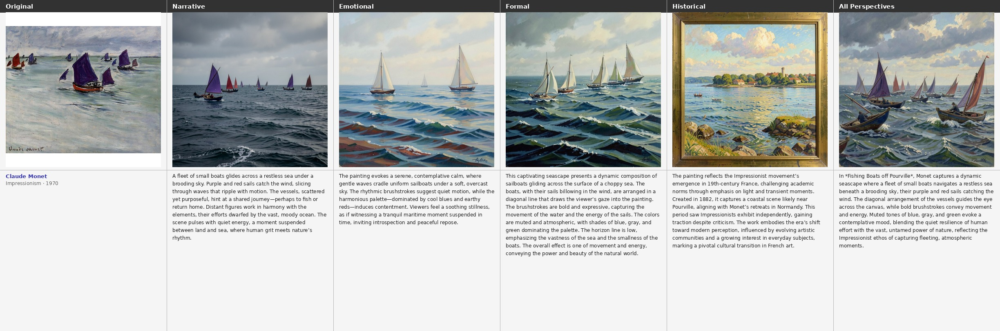
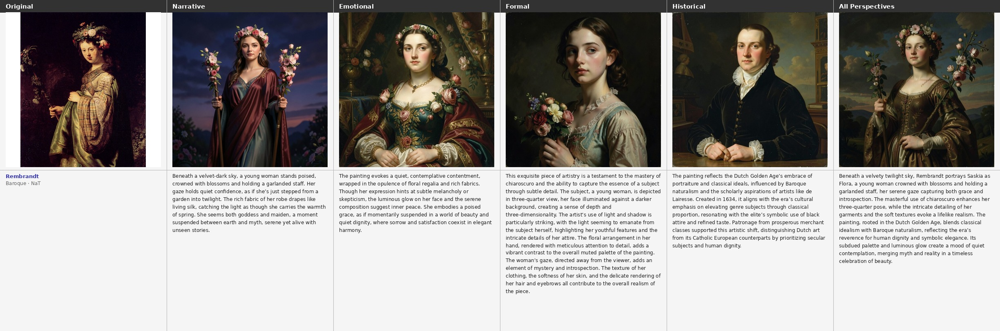
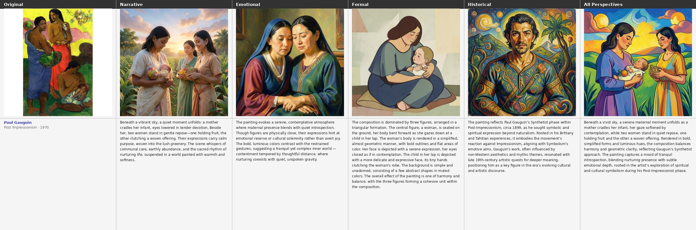
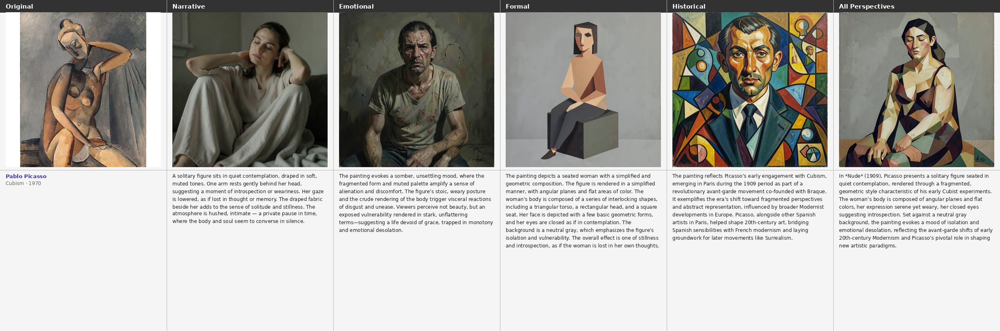
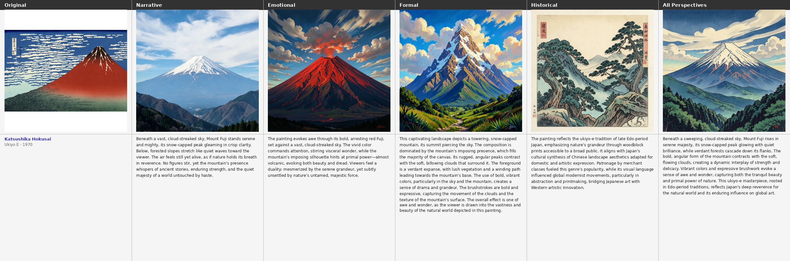
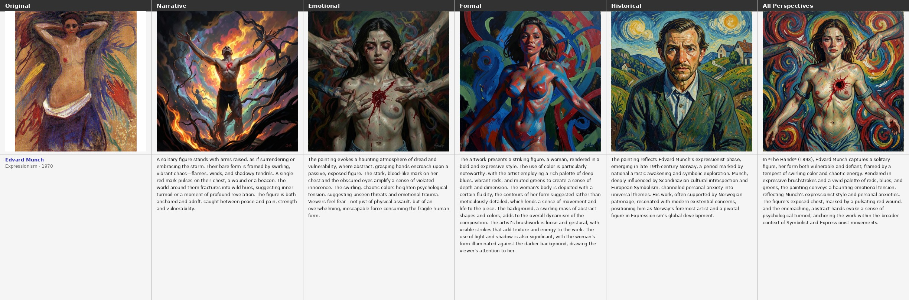

# MMArt: Supplementary Materials

> **Paper:** MMArt: A Multi-Perspective Multimodal Dataset for Visual Art Understanding  
> **Venue:** ACM Multimedia 2026, Rio de Janeiro, Brazil  
> **Submission ID:** 5179

This page provides material explicitly deferred from the main paper: full prompt templates for all five generation steps, additional implementation details not covered by space constraints, and qualitative examples from the regeneration experiment.

---

## Table of Contents

1. [Full Prompt Templates](#s1-full-prompt-templates)
2. [Additional Implementation Details](#s2-additional-implementation-details)
3. [RAG Construction (Historical Perspective)](#s3-rag-construction-historical-perspective)
4. [Quality Evaluation — LLM-as-Judge Prompt](#s4-quality-evaluation--llm-as-judge-prompt)
5. [Regeneration Experiment — Qualitative Examples](#s5-regeneration-experiment--qualitative-examples)

---

## S1. Full Prompt Templates

All vision-language models receive the painting image as visual input alongside the text prompt. Prompts are reproduced verbatim from `scripts/generate_perspectives.py`, `scripts/phase1_synthesize.py`, and `scripts/phase4_unified.py`.

---

### S1.1 Narrative Perspective (π_narr)

**Model:** `Qwen/Qwen3-VL-8B-Instruct`

```
You are an art interpretation assistant.

Given the painting titled "{title}" by {artist}, write a detailed
**narrative and scene interpretation** — what is happening or might be
happening in the scene. Focus on storytelling, implied action,
relationships between figures, and atmosphere.

Guidelines:
- Length: ~80 words
- Tone: descriptive and interpretive, not technical
- Avoid: artistic terms (e.g. "chiaroscuro", "composition"),
  historical facts, or the artist's name

Write the narrative and scene interpretation:
```

---

### S1.2 Formal Perspective (π_form)

**Model:** `GalleryGPT` (LLaVA-7B fine-tuned on PaintingForm)  
**Decoding:** deterministic (`temperature=0`, `num_beams=1`)

```
Compose a short paragraph of formal analysis for this painting.
Describe the composition, use of color and light, brushwork or technique,
spatial organisation, and any notable visual effects.
Focus purely on how the painting is made, not what it depicts or its
historical context.
Length: ~80 words.
```

---

### S1.3 Emotional Perspective (π_emot)

**Model:** `Qwen/Qwen3-VL-8B-Instruct`

Two variants are used depending on ARTEMIS-v2 coverage (99.0% of paintings use Variant A):

**Variant A — With ARTEMIS-v2 grounding:**

```
You are an art interpretation assistant.

Look at the painting "{title}" by {artist}.

Real viewers responded to this painting with the following emotional reactions:
{utterances}

The most common emotional response was: {dominant_emotion}.

Using both what you see in the painting and these viewer reactions as grounding,
write a coherent ~80-word **emotional interpretation** — the mood it evokes,
the atmosphere, and the psychological tone.
Synthesize the visual qualities of the painting with the viewer reactions
into a unified emotional description.
Write in third person (e.g. "The painting evokes..."), not first person.

Write the emotional interpretation:
```

**Variant B — Vision only** (fallback for remaining 1.0%):

```
You are an art interpretation assistant.

Given the painting titled "{title}" by {artist}, write an ~80-word
**emotional interpretation** — the mood it evokes, the atmosphere, and
the psychological tone it creates in a viewer.
Focus on emotional and affective qualities only.
Avoid describing what is depicted or analysing technique.
Write in third person (e.g. "The painting evokes...").

Write the emotional interpretation:
```

---

### S1.4 Historical Perspective (π_hist)

**Model:** `Qwen/Qwen3-VL-8B-Instruct` with RAG grounding  

Two variants depending on RAG retrieval confidence (similarity threshold = 0.25):

**Variant A — With retrieved art-history context:**

```
You are an art historian.

The following context has been retrieved from an art knowledge base about
"{title}" by {artist} ({style}, {date}):
{context}

Using the retrieved context and your knowledge of art history,
write a coherent ~80-word **historical and cultural interpretation** of this
painting — covering the artistic movement, historical period, cultural setting,
and any relevant influences, patronage, or significance.

Guidelines:
- Focus on history and cultural context only
- Do NOT describe visual elements, colours, brushwork, or composition
- Do NOT speculate on specific details not supported by the context or
  established art history
- Write in third person (e.g. "The painting reflects...")

Write the historical interpretation:
```

**Variant B — No RAG** (fallback when max similarity < 0.25):

```
You are an art historian.

Write a ~80-word **historical and cultural interpretation** of "{title}"
by {artist} ({style}, {date}) — covering the artistic movement, historical
period, cultural setting, and any relevant influences or significance.

Guidelines:
- Focus on history and cultural context only
- Do NOT describe visual elements, colours, brushwork, or composition
- If you are uncertain about specific facts for this artist or work,
  speak at the level of the movement and period
- Write in third person (e.g. "The painting reflects...")

Write the historical interpretation:
```

---

### S1.5 Perspective Synthesis Prompt (Phase 1 — Reconstruction Experiment)

**Model:** `Qwen/Qwen3-8B` (text-only, via vLLM)  
**Purpose:** Combine a subset of perspectives into a single ~80-word image-generation prompt for the reconstruction fidelity experiment. Multi-perspective conditions (e.g. NFE, NFEH) pass through this step so all conditions enter the image generator in the same text format.

**System message:**
```
You are a helpful art description writer.
```

**User message:**
```
You are an art description writer.

The following are {n} interpretive perspectives on the same painting,
"{title}" by {artist}:

- {Perspective label}:
  {perspective text}

...

Write a single coherent ~80-word description that integrates all these
perspectives into one unified passage. Do not label or list the perspectives
separately. Write fluently in third person. Output only the description,
nothing else.
```

---

### S1.6 Unified Caption (Phase 4 — e_unif field)

**Model:** `Qwen/Qwen3-8B` (text-only, via vLLM)  
**Purpose:** Generate the `e_unified` field for each of the 74,234 paintings in the full dataset — a ~150-word integrated description that serves as the unified caption baseline in benchmark evaluations.

**System message:**
```
You are an art writer producing unified painting descriptions for an academic dataset.

Given four analytical perspectives on a painting, write a single unified
description of approximately 150 words that integrates all four perspectives
into coherent prose.

Rules:
- Do not use section headers or bullet points
- Do not start with "This painting" or "The painting"
- Write in present tense, third person
- Preserve specific details from each perspective: what is depicted,
  visual structure and technique, emotional atmosphere, and art-historical context
- Output only the description, nothing else
```

**User message:**
```
Painting: "{title}" by {artist}

[Narrative]
{e_narrative text}

[Formal]
{e_formal text}

[Emotional]
{e_emotional text}

[Historical]
{e_historical text}

Write a unified ~150-word description integrating all perspectives above.
```

---

## S2. Additional Implementation Details

The main paper states all VLM perspectives use `max_tokens=256` with default decoding temperature. The following details were omitted from the paper due to space constraints.

### Text-only LLM Generation (Qwen3-8B via vLLM)

These apply to Phase 1 synthesis (S1.5) and Phase 4 unified caption generation (S1.6):

| Parameter | Phase 1 (synthesis) | Phase 4 (unified) |
|---|---|---|
| Temperature | 0.3 | 0.3 |
| Top-P | 0.9 | 0.9 |
| Max tokens | 200 | 250 |
| Repetition penalty | 1.05 | 1.05 |
| Dtype | bfloat16 | bfloat16 |
| Batch size | 512 | 64 |
| `enable_thinking` | False | False |

### Image Generation (Phase 2)

| Model | Steps | Guidance Scale | Gen. Resolution | Output Resolution |
|---|---|---|---|---|
| FLUX.2-Klein-4B | 4 | 1.0 | 1024 × 1024 | 512 × 512 |
| Qwen-Image-2512 | 25 | 4.0 (true CFG) | 1024 × 1024 | 512 × 512 |

Qwen-Image uses negative prompt: `"blurry, low quality, deformed, ugly, text, watermark, signature, extra limbs, bad anatomy"`. Downsampling uses Lanczos resampling. Fixed seed: `42`.

### Shared vLLM Infrastructure

| Parameter | Value |
|---|---|
| `max_model_len` | 4096 tokens |
| `gpu_memory_utilization` | 0.85 |
| Vision image range | min: 256×28², max: 1280×28² pixels |
| Random seed | 42 |

---

## S3. RAG Construction (Historical Perspective)

The main paper states that the top-5 context documents are retrieved via embedding ranking. The full retrieval pipeline is as follows.

### Chunk Index

- **Embedding model:** `sentence-transformers/all-MiniLM-L6-v2` (384-dimensional, L2-normalized)
- **Chunking:** sliding window — 1,000 tokens per chunk, 100-token stride over Wikipedia art pages
- **Index format:** binary embedding matrix (`vdb_chunks.json`) + text key-value store (`kv_store_text_chunks.json`)

### Retrieval at Inference

For each painting, a query string is constructed from title, artist, style, and date:

1. Embed the query with the local sentence-transformer (~2 ms on CPU)
2. Compute cosine similarity against all chunk embeddings (L2-normalized dot product)
3. If `max_similarity < 0.25` → no relevant context found; fall back to Variant B (no-RAG) prompt
4. Otherwise return the **top-3** chunks by similarity as `{context}` in the prompt

| Parameter | Value |
|---|---|
| Embedding model | `sentence-transformers/all-MiniLM-L6-v2` |
| Embedding dim | 384 |
| Similarity metric | Cosine (L2-normalized dot product) |
| Similarity threshold | 0.25 |
| Top-k chunks | 3 |

---

## S4. Quality Evaluation — LLM-as-Judge Prompt

The main paper reports judge scores (Table 3) and states the full prompt is in the supplementary. The judge model is `google/gemma-3-27b-it` (`temperature=0.1`, `max_tokens=150`).

### System Prompt

```
You are an expert art critic evaluating AI-generated art descriptions.
You will be shown a painting and one perspective description. Rate it on three dimensions.
Respond ONLY with valid JSON, no other text.
```

### User Prompt Template

```
Painting metadata: Artist={artist}, Style={style}, Date={date}

Perspective type: {label}
Expected focus: {focus_desc}

Description to evaluate:
"""{perspective_text}"""

Rate this description on a scale of 1-5 for each dimension:
- perspective_fidelity: Does the text genuinely focus on {label} aspects?
  (1=wrong focus, 5=excellent focus)
- factual_accuracy: Is the content factually correct about this painting?
  (1=many errors, 5=accurate)
- depth: Does it provide substantive detail beyond generic description?
  (1=generic, 5=highly specific)

Respond with ONLY this JSON:
{"perspective_fidelity": <1-5>, "factual_accuracy": <1-5>, "depth": <1-5>, "reasoning": "<one sentence>"}
```

### Focus Descriptors per Perspective

| Perspective | Expected focus passed to judge |
|---|---|
| Narrative | the depicted subjects, scenes, narrative elements, and actions |
| Formal | composition, palette, brushwork, technique, and visual structure |
| Emotional | mood, emotional atmosphere, and affective qualities the work evokes |
| Historical | art movement, historical period, cultural context, and artist's style |
| Unified | an integrated view combining narrative, formal, emotional, and historical aspects |

---

## S5. Regeneration Experiment — Qualitative Examples

Each row shows the original painting alongside its regenerations under five perspective conditions: **N** (Narrative), **E** (Emotional), **F** (Formal), **H** (Historical), and **NFEH** (all four combined). The synthesized ~80-word caption used as the image-generation prompt is shown beneath each regeneration. Image generation model: **FLUX.2-Klein**.

Columns are ordered: Original → N → E → F → H → NFEH.

---

### Example 1 — Impressionism
**Claude Monet, *Fishing Boats off Pourville* (Impressionism)**



The loose brushwork and coastal atmosphere are partially recovered under N and E, but the formal description (F) best preserves the painting's hazy light and compositional structure. NFEH produces the most faithful reconstruction, capturing both the style and the scene.

---

### Example 2 — Baroque
**Rembrandt, *Saskia as Flora* (1634, Baroque)**



The portrait character is strongly recovered under F (chiaroscuro, three-quarter pose) and NFEH. The historical perspective (H) drifts toward a generic Dutch Golden Age portrait, while the emotional (E) captures the contemplative tone. NFEH integrates all cues into the closest match to the original.

---

### Example 3 — Post-Impressionism
**Paul Gauguin, *Maternité II* (1899, Post-Impressionism)**



The Tahitian palette and flat figure arrangement are visible across all conditions, but N focuses on the figures, F captures the colour planes and composition, and H surfaces the Primitivism context. NFEH combines all signals into the richest and most characteristic result.

---

### Example 4 — Cubism
**Pablo Picasso, *Nude* (1909, Cubism)**



The Cubist fragmentation is hardest to recover from text alone. N and E produce conventional figurative paintings; F partially recovers the geometric faceting. NFEH integrates the formal vocabulary with historical context (early Cubism, Braque influence) to produce the most stylistically accurate reconstruction.

---

### Example 5 — Ukiyo-e
**Katsushika Hokusai, *Fuji Mountains in Clear Weather* (1831, Ukiyo-e)**



The flat graphic style and iconic red Fuji silhouette are consistently recovered across all conditions — this style is highly distinctive in text. The main gain from NFEH is in compositional accuracy (cloud placement, layered planes) and the characteristic woodblock colour palette.

---

### Example 6 — Expressionism
**Edvard Munch, *The Hands* (1893, Expressionism)**



The psychologically charged atmosphere is strongest in E, which captures the dread and vulnerability of the figure. F recovers the dynamic figure-ground composition, while H contextualises the work within Munch's Expressionist symbolism. NFEH produces the most complete result, combining the affective tone with the compositional and historical signals.

---

*All composites generated with FLUX.2-Klein-4B (4 steps, guidance scale 1.0, seed 42). Full composite set (1,000 paintings × 2 models) is available in the dataset release.*
